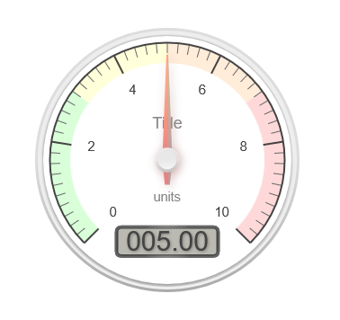

# WP Gauges

A WordPress plugin for creating animated gauges using simple shortcodes. Perfect for displaying metrics, progress indicators, or any numerical data in an engaging visual format.




## Features

- 🎯 Radial gauges with customizable appearance
- 🎨 Color-coded sections for different value ranges
- ⚡ Smooth animations
- 📱 Fully responsive design
- 🛠️ User-friendly shortcode generator
- 🎮 Live preview while configuring
- 🎯 Customizable tick marks and values
- 🎨 Flexible color schemes

## Installation

1. Download the plugin from WordPress.org or clone this repository
2. Upload the `wp-gauges` folder to your `/wp-content/plugins/` directory
3. Activate the plugin through the 'Plugins' menu in WordPress
4. Access the shortcode generator via WP Gauges in your WordPress admin menu

## Usage

### Quick Start

The simplest way to create a gauge is to use the built-in shortcode generator:

1. Go to WordPress Admin → WP Gauges
2. Configure your gauge using the visual interface
3. Click "Generate Shortcode"
4. Copy the generated shortcode and paste it into your post or page

### Manual Shortcode Configuration

You can also create gauges manually using the `[gauge]` shortcode. Here's the basic syntax without colors:

```text
[gauge title="Speed" units="mph" min="0" max="100" animateto="65" ticks="0 10 20 30 40 50 60 70 80 90 100"]
```

### Available Parameters

| Parameter | Description | Default | Example |
|-----------|-------------|---------|---------|
| title | The gauge title | "Title" | title="Speed" |
| units | Units to display | "units" | units="mph" |
| titletag | HTML tag for title | "h2" | titletag="h3" |
| titlecol | Title color | "black" | titlecol="#444444" |
| ticks | Space-separated tick values | "0 2 4 6 8 10" | ticks="0 25 50 75 100" |
| min | Minimum value | 0 | min="0" |
| max | Maximum value | 10 | max="100" |
| initial | Starting value | 0 | initial="20" |
| animateto | Target value for animation | 5 | animateto="75" |
| green | Green range (format: "start end") | - | green="0 30" |
| yellow | Yellow range (format: "start end") | - | yellow="30 60" |
| orange | Orange range (format: "start end") | - | orange="60 80" |
| red | Red range (format: "start end") | - | red="80 100" |

### Color Ranges

You can define up to four color-coded ranges on your gauge:

```text
[gauge title="Temperature" units="°C" ticks="0 10 20 30 40 50 60 70 80 90 100" min="0" max="100" green="0 30" yellow="30 60" orange="60 80" red="80 100" animateto="75"]
```

### Examples

1. **Basic Speedometer**

```text
[gauge title="Speed" units="mph" min="0" max="120" ticks="0 20 40 60 80 100 120" animateto="65"]
```

2. **Temperature Gauge with Color Ranges**

```text
[gauge title="Temperature" units="°C" min="0" max="100" ticks="0 20 40 60 80 100" green="0 30" yellow="30 60" orange="60 80" red="80 100" animateto="75"]
```

3. **Progress Indicator**

```text
[gauge title="Progress" units="%" min="0" max="100" ticks="0 25 50 75 100" green="75 100" yellow="50 75" orange="25 50" red="0 25" animateto="82"]
```

## Customization Tips

### Styling the Title

- Use `titletag` to match your theme's heading hierarchy
- Adjust `titlecol` to match your theme's color scheme

### Creating Effective Ranges

- Use color ranges that make sense for your data
- Consider using fewer ranges for simpler visuals
- Ensure ranges don't overlap
- Use ranges that align with your tick marks

### Animation

- Set `initial` to start from a specific value
- Use `animateto` for the target value
- Remove `animateto` to create a static gauge

## Frequently Asked Questions

### Can I have multiple gauges on the same page?

Yes! You can add as many gauges as you need using different shortcodes.

### Does it work with page builders?

Yes, the shortcode works with most popular page builders including Elementor, Divi, and WPBakery Page Builder.

### Can I change the size of the gauge?

The gauge automatically adjusts to its container width while maintaining aspect ratio.

### How can I remove the animation?

Simply omit the `animateto` parameter, and the gauge will remain static at the initial value.

## Contributing

Contributions are welcome! Please feel free to submit a Pull Request.

## License

This project is licensed under the GPL-2.0+ License - see the [LICENSE.txt](LICENSE.txt) file for details.

## Credits

Created by [Andy Gee](https://dgte.pro)
Based on [Canvas Gauges](https://canvas-gauges.com/)
